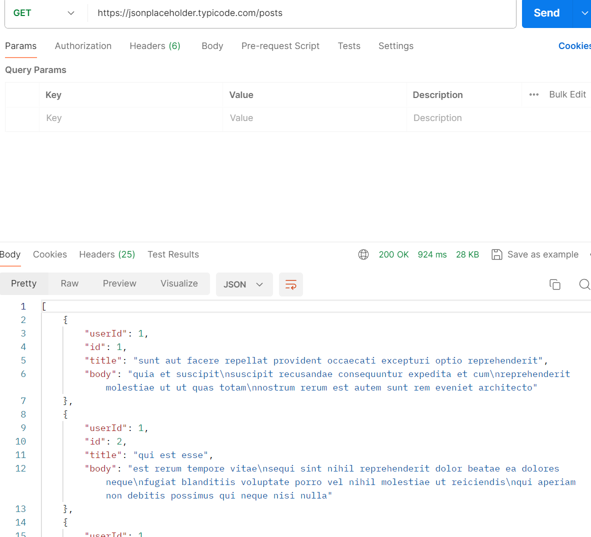
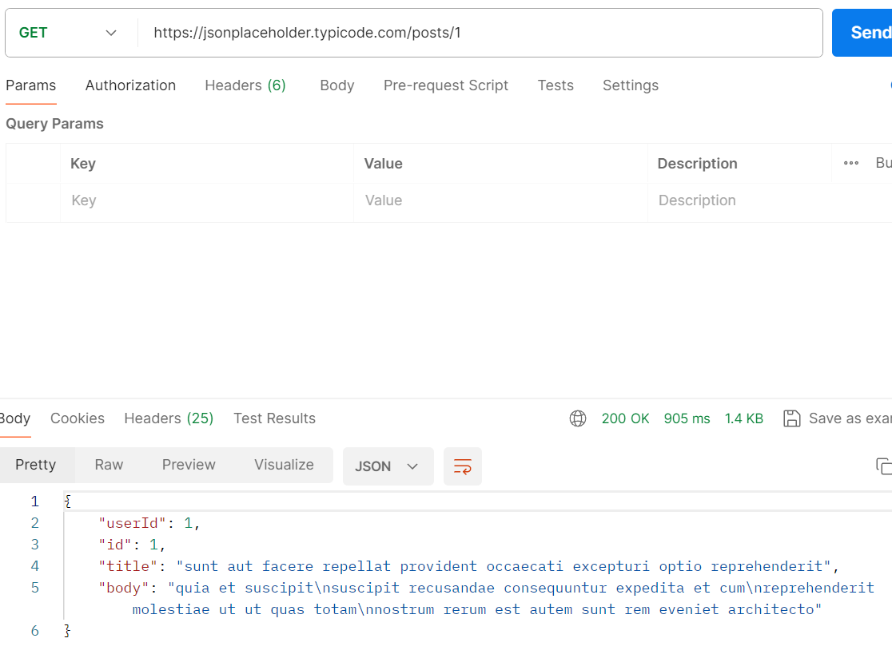
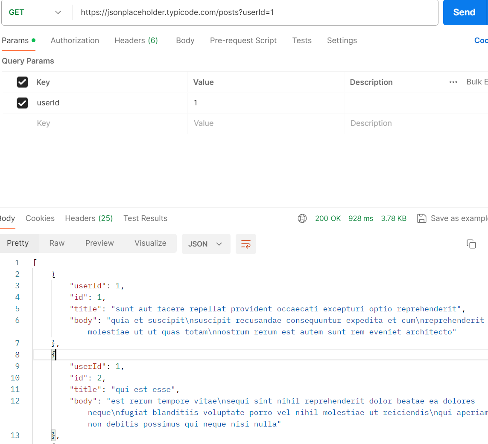
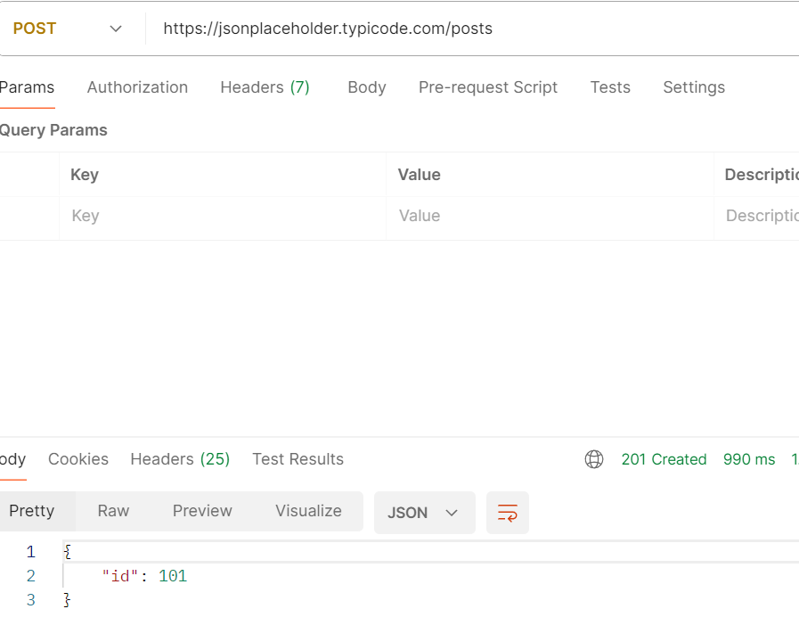

# 实践练习：Postman 接口测试入门

> **来源**: `schedule/daily-plan.md` — 2026-06-04 学习计划，主题 2: Postman 接口测试入门
> **状态**: ⏳ 待完成 — 完成后输入 `批改` 进行评分

## 练习题目

使用公开测试 API（JSONPlaceholder: `https://jsonplaceholder.typicode.com`）完成以下操作：

1. **发送一个 GET 请求**：获取帖子列表 `GET /posts`，观察 Response 的 Status Code、Body（JSON 格式）、Headers
2. **发送一个带参数的 GET 请求**：查询单个帖子 `GET /posts/1` 和按用户筛选 `GET /posts?userId=1`，对比两次返回的区别
3. **发送一个 POST 请求**：创建新帖子 `POST /posts`，Body 为 JSON 格式 `{"title": "测试标题", "body": "测试内容", "userId": 1}`，观察返回的状态码和 Body 中是否包含 `id: 101`
4. **截图记录**：截取每个请求的 Response 面板（含 Status、Body），粘贴到输出文件中
5. **总结**：用自己的话回答——参数放 URL 和放 Body 有什么区别？

---

## 我的答案

<!-- 请在下方填写你的答案。 -->

### 1. GET /posts 请求

**请求**: `GET https://jsonplaceholder.typicode.com/posts`

- Status Code: __200____
- Body 结构简述（返回了什么？多少条数据？）: __body主要返回的是正文，一共100条数据____
- 关键的 Response Headers（Content-Type 等）: ____
Content-Type:application/json;charset=utf-8
Connection:keep-alive
Server:cloudflare

__

---

### 2. 带参数的 GET 请求

**请求 A**: `GET /posts/1`
- Status Code: ___200___
- 返回的数据条数: __1____
- 简述返回内容: ___sunt aut facere repellat provident occaecati excepturi optio reprehenderit___

**请求 B**: `GET /posts?userId=1`
- Status Code: ___200___
- 返回的数据条数: _10_____
- 简述返回内容: ___太多了，不想复制___

**对比**: 两次请求返回的数据有什么不同？为什么？

[在此填写你的回答]
一个是以id为参数，另一个是以userId为参数

---

### 3. POST /posts 请求

**请求**: `POST https://jsonplaceholder.typicode.com/posts`
**Body**:
```json
{"title": "测试标题", "body": "测试内容", "userId": 1}
```

- Status Code: __201____
- 返回的 Body 中是否包含 `id`？它的值是什么？: ___包含，值为101___
- 这个 `id` 101 说明什么？: ___第101个JSON数据？___

---

### 4. 截图

<!-- 粘贴你的 Postman 截图到这里，每个请求至少一张截图（含 Response 面板的 Status 和 Body） -->

**GET /posts**:


**GET /posts/1**:


**GET /posts?userId=1**:


**POST /posts**:


---

### 5. 总结

**问题**: 参数放 URL 和放 Body 有什么区别？什么时候用哪种方式？

[在此填写你的回答]
放URL时，直接将参数显露在URL上
放Body时，是将参数以请求头的方式传递
当参数涉及隐私/影响URL时，可以将数据放Body。否则，就可以放URL上
---

> **提交方式**: 将上方的答案填写完整后，在对话中输入 `批改` 即可获得评分和反馈。

---

## 修正参考

### 5. 总结（修正版）

**参数放 URL 和放 Body 的区别：**

| 维度 | URL 参数（Query String） | Body 参数 |
|------|------------------------|-----------|
| 位置 | URL 中 `?` 之后，如 `?userId=1` | HTTP 请求体中 |
| HTTP 方法 | 主要用于 GET 请求 | 主要用于 POST/PUT/PATCH |
| 可见性 | 明文显示在 URL 中，浏览器地址栏可见 | 不在 URL 中，浏览器地址栏不可见 |
| 长度限制 | 有（浏览器/服务器通常限制 ~2KB-8KB） | 无明确限制 |
| 缓存 | 会被浏览器/代理缓存 | 默认不缓存 |
| 书签 | 可收藏带参数的 URL | 不可收藏（参数在 Body 中） |
| 用途 | 查询、筛选、分页（如 `?page=1&size=10`） | 创建/修改资源的数据提交 |

**什么时候用哪种？**
- **URL 参数**：GET 请求的数据过滤、搜索、分页。如获取某用户的帖子 `GET /posts?userId=1`
- **Body**：POST/PUT 请求提交数据。如创建新帖子 `POST /posts`，Body 带 `{"title":"...", "body":"..."}`
- **不要混用**：GET 请求通常没有 Body（虽然技术上可以，但不规范）

### GET /posts?userId=1 返回内容（示例）

```json
[
  {
    "userId": 1,
    "id": 1,
    "title": "sunt aut facere repellat provident occaecati excepturi optio reprehenderit",
    "body": "quia et suscipit..."
  }
  // ... 共 10 条
]
```

> **关键观察**：返回的是数组 `[...]`，不是单个对象 `{...}`。`/posts/1` 返回 `{...}`，这是两者的根本区别。
